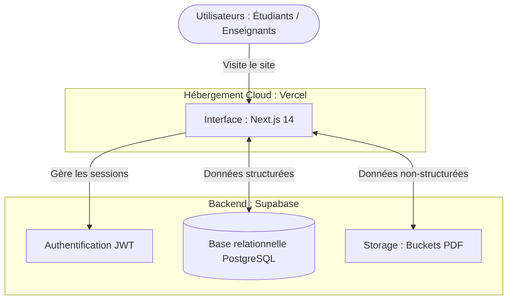

# 🎓 Dourous-Net — Plateforme Éducative Asynchrone

> **Projet de Fin de Module · Architecture Cloud & Vibe · 2CP 2026**
> **Thème 4 : Éducation**

Dourous-Net connecte enseignants (créateurs de savoirs) et étudiants dans un espace fluide permettant le partage de cours et d'exercices.

## 🛠️ Technologies & Fonctionnalités
- **Front-end :** Next.js 14, Tailwind CSS, multilingue (Fr/En/Ar).
- **Back-end :** Supabase (PostgreSQL, Auth, Storage).
- **Cloud :** Vercel (CI/CD, Serverless Edge).
- **Acteurs :** Les enseignants créent des modules et suivent les vues ; les étudiants recherchent des professeurs, consultent les cours et soumettent leurs devoirs.

## 🌐 Projet Déployé (Vercel)
L'application est accessible en ligne ici : **[https://dourous-net-nine.vercel.app/](https://dourous-net-nine.vercel.app/)**

## 🚀 Lancement (Local)
1. Créez `.env.local` avec `NEXT_PUBLIC_SUPABASE_URL` et `NEXT_PUBLIC_SUPABASE_ANON_KEY`.
2. Sur Supabase, assurez-vous que les tables existent et lancez les scripts RLS fournis.
3. Créez les buckets `course-files` et `interaction-files` dans Storage.
4. Lancez avec `npm install && npm run dev`.

---

## 🗺️ Mission 4 : Architecture & Données

### Schéma Général

### Mapping du Thème

| Composant | Correspondance DB | Description |
|-----------|-------------------|-------------|
| **Table A** | `profiles` | Utilisateurs (Étudiants/Enseignants). Centralise bio, wilaya et notation. Gérée via les triggers Auth. |
| **Table B** | `courses` | Ressources. Métadonnées des cours (titre, sujet) rattachées à l'auteur (`teacher_id`). |
| **Table C** | `interactions` | Activité d'apprentissage. Table de jointure reliant un étudiant (`user_id`) à un cours (`course_id`). |
| **Fichiers** | `Storage` | Documents hébergés dans les buckets Supabase `course-files` et `interaction-files`. |

### Sécurité (RLS)
- **`profiles` :** Lecture publique, modification par le propriétaire.
- **`courses` :** Lecture publique, insertion/modification par l'enseignant créateur.
- **`interactions` :** Restreintes à l'étudiant concerné et à l'enseignant du cours lié.

---

## 🏗️ Mission 4 : Analyse d'Architecture Cloud

### 1. Vercel + Supabase vs Serveurs Classiques
L'approche Cloud moderne permet d'éviter les coûts massifs d'investissement de départ (**CAPEX**) pour l'achat de serveurs physiques. En passant sur un modèle **OPEX** (dépenses opérationnelles), et grâce au modèle *Pay-as-you-go*, l'application démarre sans risque financier. On ne paie que pour les ressources réellement consommées.

### 2. Scalabilité Vercel vs Data Center
Dans un Data Center classique, un pic de trafic nécessite d'ajouter manuellement de nouveaux **serveurs rackables** et pose des défis majeurs de **climatisation** pour éviter la surchauffe. Avec Vercel, l'architecture *Serverless Edge* gère tout : elle déploie automatiquement de nouvelles instances en quelques millisecondes pour absorber la charge sans aucune intervention humaine.

### 3. Données Structurées vs Non-structurées
- **Structurées :** Gérées par notre SGBDR **PostgreSQL** (tables `profiles`, `courses`, `interactions`). Elles obéissent à un schéma strict (UUID, clés étrangères, contraintes) et sont idéales pour des requêtes SQL complexes (ex: filtrage des enseignants par spécialité).
- **Non-structurées :** Hébergées sur **Supabase Storage** (supports PDF, devoirs étudiants). Ce sont des données brutes (blobs binaires) sans structure tabulaire, stockées telles quelles car non interrogeables via SQL.
